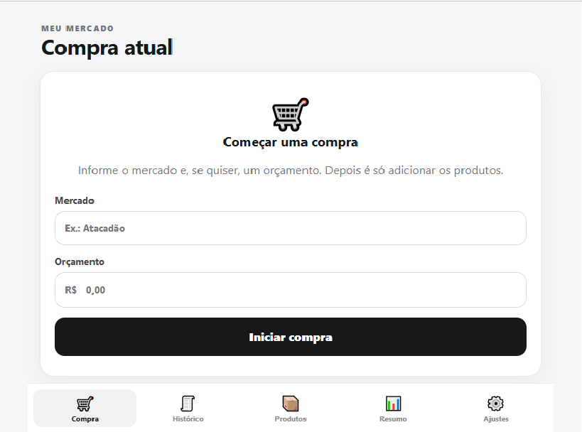
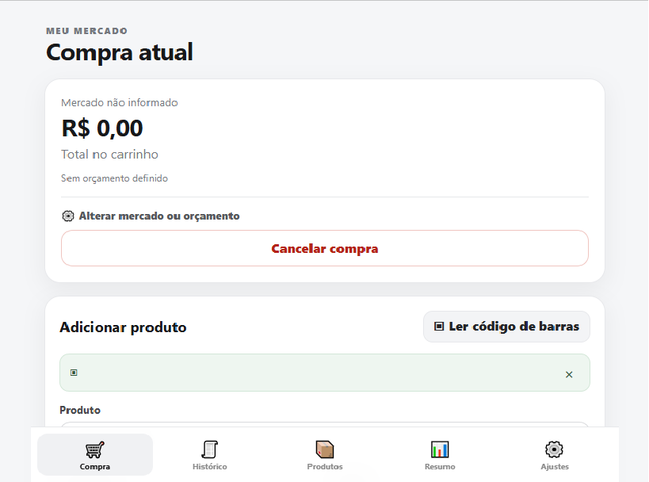
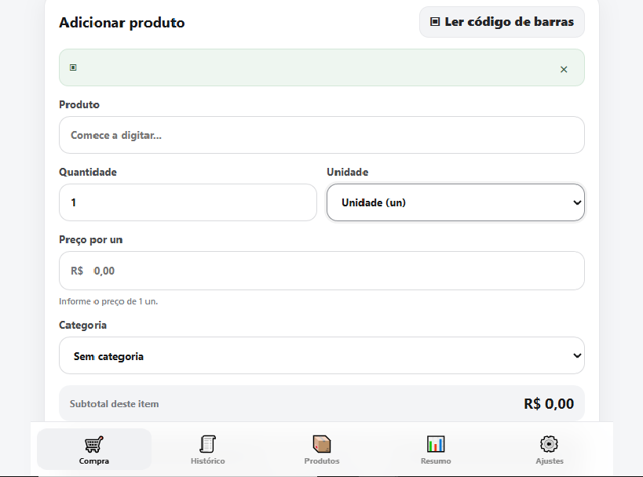
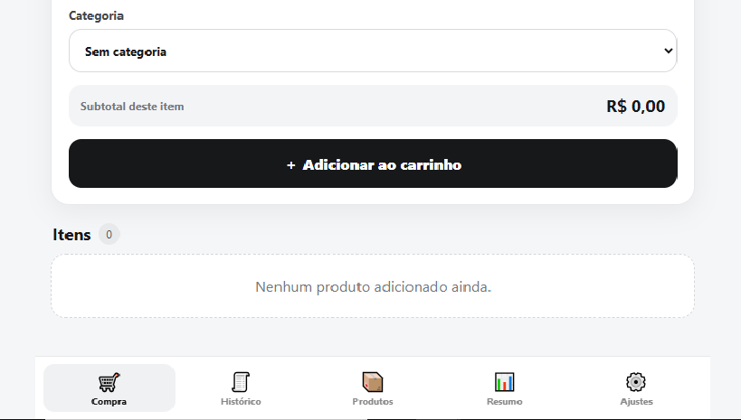
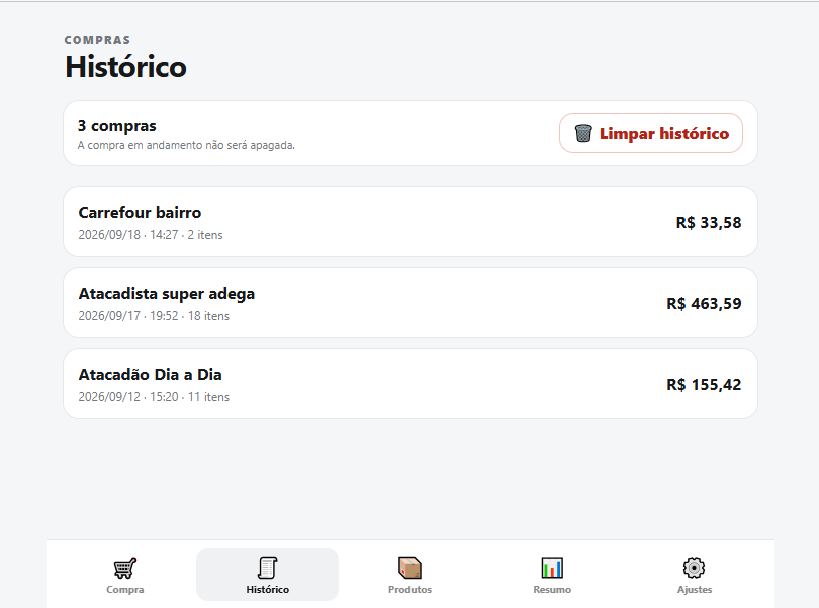
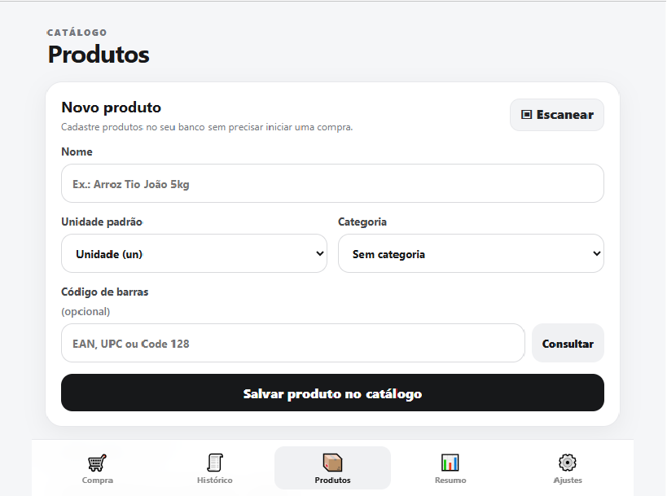
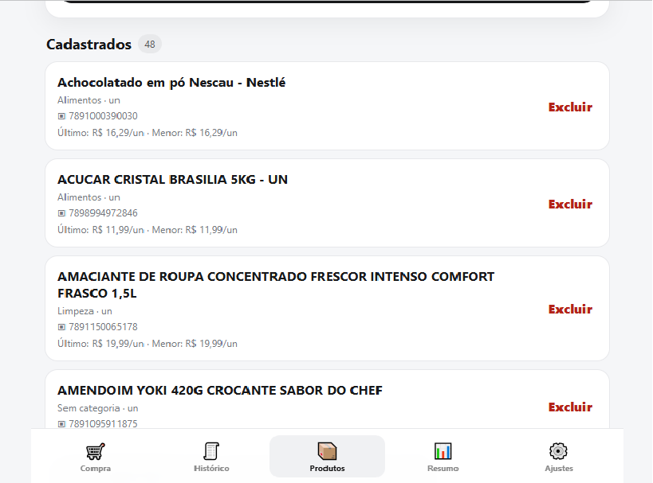
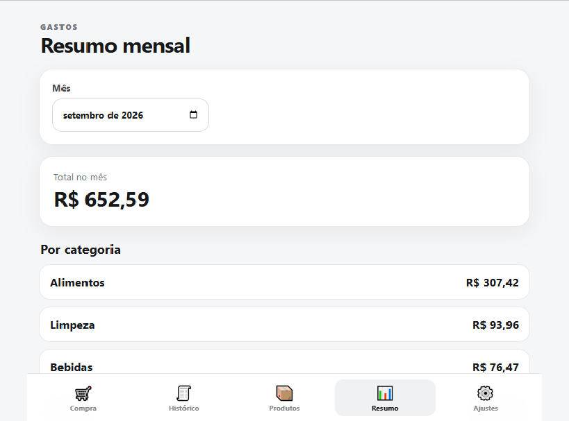

# 🛒 Meu Mercado

Aplicativo web de controle de compras de mercado, desenvolvido em Python/Flask e pensado para uso principalmente pelo celular.

## 📱 Interface

### 🛒 Tela de compra

A tela de compra permite adicionar produtos, informar valores e acompanhar o total da compra em tempo real.

<p align="center">
  
</p>

---

### 🏁 Iniciando uma compra

O fluxo de início de compras permite definir o mercado e o orçamento antes de começar a adicionar os produtos.

<p align="center">
  
  
  
</p>

---

### 📜 Histórico

O histórico permite consultar compras realizadas anteriormente e acompanhar os registros das compras.

<p align="center">
  
</p>

---

### 📦 Produtos

O catálogo de produtos permite cadastrar, consultar e organizar os produtos utilizados nas compras.

<p align="center">
  
  
</p>

---

### ⚙️ Ajustes

A área de ajustes concentra as configurações e opções de gerenciamento do aplicativo.

<p align="center">
  
  
  
</p>

---

### 📊 Resumo

A tela de resumo apresenta informações consolidadas sobre as compras e os gastos.

<p align="center">
  
</p>

## ✨ Recursos

- Cadastro de mercados e orçamento
- Lista de produtos e categorias
- Soma automática dos itens
- Produtos por unidade e por peso
- Histórico de compras
- Resumos de gastos
- Leitura de códigos de barras pela câmera
- Cadastro de produtos por código de barras sem iniciar uma compra
- Busca automática de produtos por:
  1. catálogo local
  2. Open Food Facts
  3. Bluesoft Cosmos
- Catálogo local para evitar consultas externas repetidas
- Backup automático do catálogo de produtos
- Backup manual e restauração do catálogo
- Interface responsiva para celular
- Execução em Docker

## 🧰 Tecnologias

- Python
- Flask
- SQLite
- HTML / CSS / JavaScript
- ZXing Browser para leitura de códigos de barras
- Open Food Facts
- Bluesoft Cosmos (opcional)
- Docker / Docker Compose

## 📁 Estrutura

```text
.
├── app.py
├── requirements.txt
├── Dockerfile
├── docker-compose.yml
├── .env.example
├── templates/
├── static/
├── data/
│   └── .gitkeep
└── backups/
    └── .gitkeep
```

Os diretórios `data/` e `backups/` são dados de execução e ficam fora do Git.

## 🚀 Rodando com Docker

1. Copie `.env.example` para `.env`.
2. Defina uma `SECRET_KEY`.
3. Se quiser o Cosmos, informe `COSMOS_API_TOKEN` e `COSMOS_USER_AGENT`.
4. Inicie:

```bash
docker compose up -d --build
```

O aplicativo ficará disponível em:

```text
http://localhost:5052
```

### ZimaOS

No seu ZimaOS, você pode manter o banco em `data/` e mandar os backups para um HDD usando:

```env
BACKUP_HOST_PATH=/path/to/your/backup
```

Depois:

```bash
docker compose up -d --build
```

O Compose monta:

```text
${BACKUP_HOST_PATH} -> /app/backups
```

Assim, a localização física do backup fica configurável e não precisa ficar presa ao código do projeto.

## 🔐 Cosmos / Bluesoft

A integração é opcional.

Você pode configurar pelo arquivo `.env`:

```env
COSMOS_API_TOKEN=seu_token
COSMOS_USER_AGENT=Cosmos-API-Request
```

ou pela tela de configurações do próprio aplicativo.

**Nunca publique seu token, seu `.env` ou seu banco SQLite.**

## 📱 Código de barras

O scanner funciona em contexto HTTPS nos navegadores que exigem um contexto seguro para acesso à câmera.

Em uma instalação usando Tailscale, uma opção é usar o Tailscale Serve apontando para a porta `5052`.

Exemplo quando o Tailscale está em um container chamado `tailscale`:

```bash
docker exec -it tailscale tailscale serve --bg 5052
docker exec -it tailscale tailscale serve status
```

Depois use o endereço HTTPS exibido pelo Tailscale.

## 💾 Backup

O catálogo de produtos pode ser exportado pela tela de configurações.

O backup contém informações do catálogo, como:

- nome
- código de barras
- unidade
- categoria

Não deve conter compras, histórico ou credenciais do Cosmos.

Para proteger os dados contra falha do servidor, recomenda-se manter uma cópia do backup fora do próprio ZimaOS.

## ⚠️ Importante antes de publicar

Não envie para o GitHub:

- `.env`
- `data/mercado.db`
- arquivos `.db` / `.sqlite`
- backups pessoais
- tokens ou API keys
- configurações específicas da sua rede/Tailscale

Este projeto usa `.gitignore` para evitar esses arquivos.

## 📄 Licença

Escolha uma licença antes de publicar. Se você quer permitir que outras pessoas usem e modifiquem o projeto, MIT é uma opção simples. Se ainda não tiver certeza, deixe a licença para decidir depois.

## 🤝 Contribuições

Sugestões, correções e melhorias são bem-vindas por meio de Issues e Pull Requests.
